# Creating  a Wordpress site using Microsoft Azure Portal

---------------------------------------------------------

## Requirements
- Microsoft Azure Account ( with funds or credits    )
- Microsoft Azure Suscription
- A web browser
- Access to internet

---------------------------------------------------------

## Instructions
#### 1. Login to the [Azure Portal](https://portal.azure.com/).
#### 2. Once your on the portal's home page, you will see something like this:

#### 3. Inside the search bar (located at the top), look for *marketplace* and click on it.
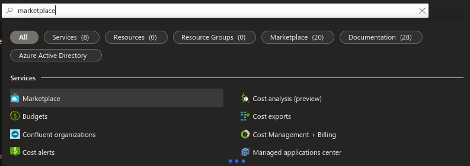
#### 4. Once you're inside the marketplace, search for *Wordpress* using the other searchbar.
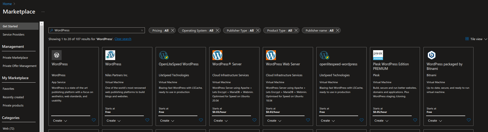
#### 5. Look for the *WordPress* product and click on it.
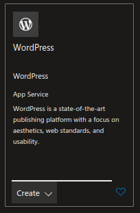
#### 6. Click on *Create*.
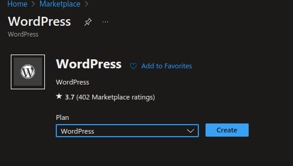
#### 7. You will now be prompted to create a new App Service. Once you have selected the correct subscription, you'll need to create a new resource group (you can also use one that you had before). In order to create a new one, just click on *Create new*, give it a name, and click *Ok*.
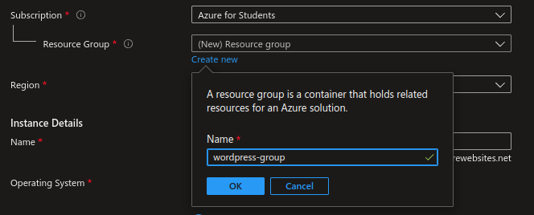
#### 8. You can also choose the specific region where you want to locate your service in. I am located in Mexico, so I will choose a region inside the US so there isn't a lot of latency.
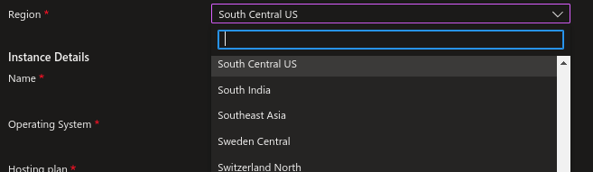
#### 9. Now you have to configure the instance details. You will need to give it a name as well as choose it's operating system; in this case, I will choose Linux.
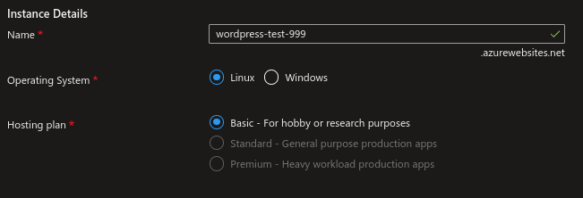
#### 10. Once you're done, click on *Review + create* at the bottom of the page.

#### 11. If there are no problems with your configuration, click on *Create* at the bottom of the page.

#### 12. Deployment will be in process, please wait a couple of minutes.
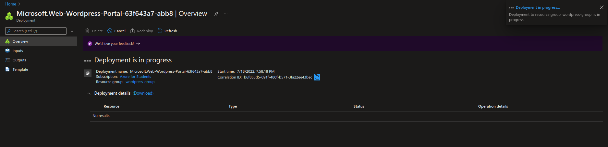
#### 13. Once the implementation is complete, click on *Go to resource*.
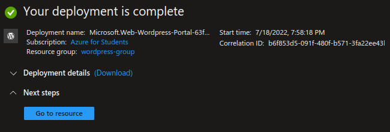
#### 14. Click on the URL of your website.

#### 15. If you accesed your website immediately, you may need to wait a few more minutes for Wordpress to install.
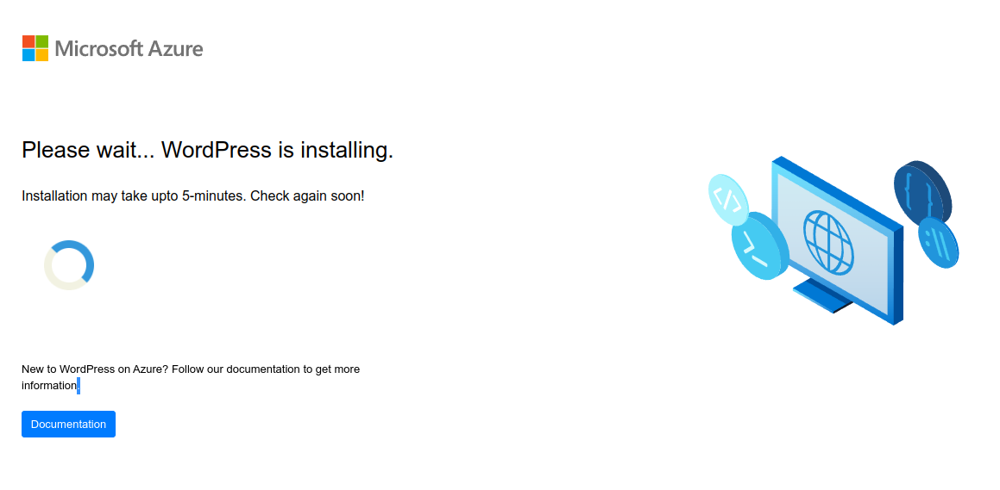
#### 16. Once your Wordpress has been installed, you will see the following screen:
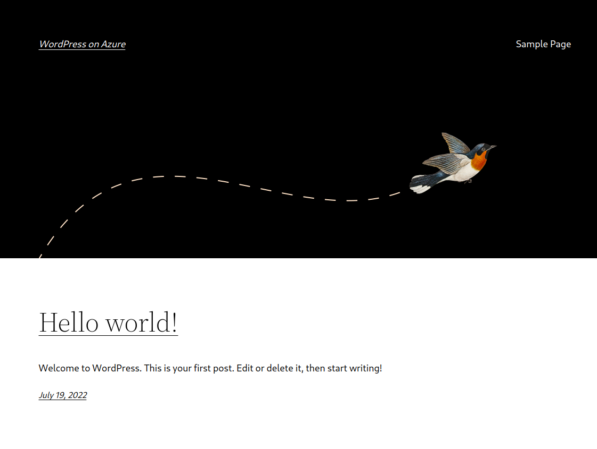
#### 17. In order to access the admin configuration, click on your browser searchbar and add the word .*admin*.

#### 18. Now, you'll need to login with the credentials you configured in Azure.
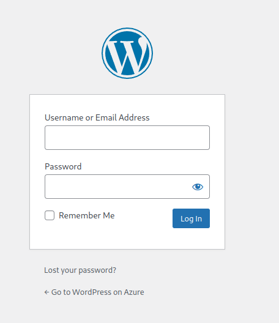
#### 19. Finally, you will be inside the Wordpress panel, where you can configure your website, add users, install extensions and much more!
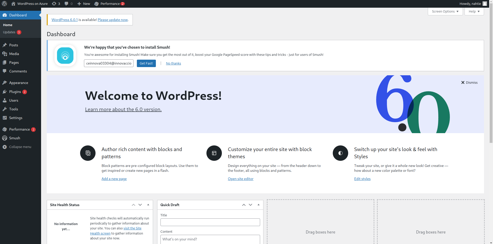

---------------------------------------------------------

## Congratulations ! You've just made your first website using Azure !
